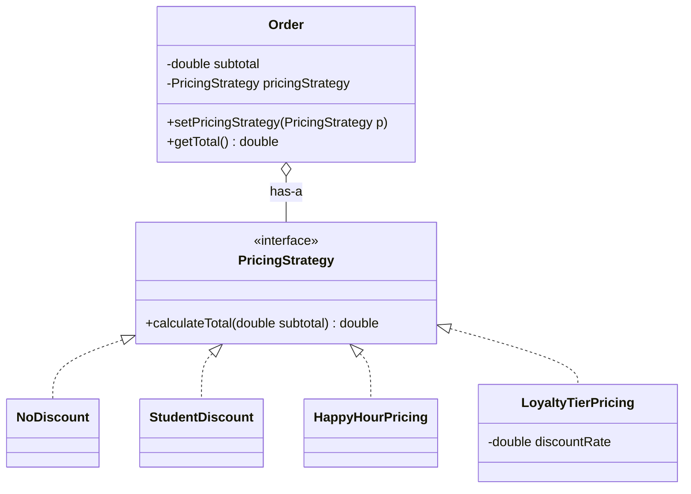
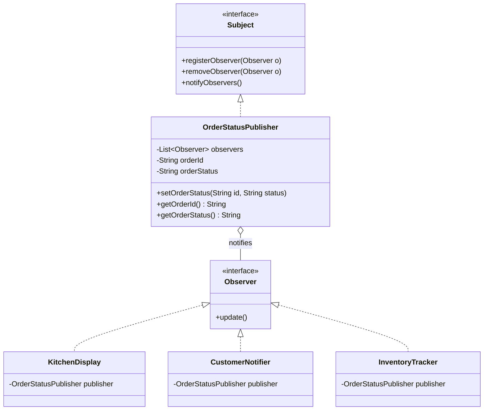
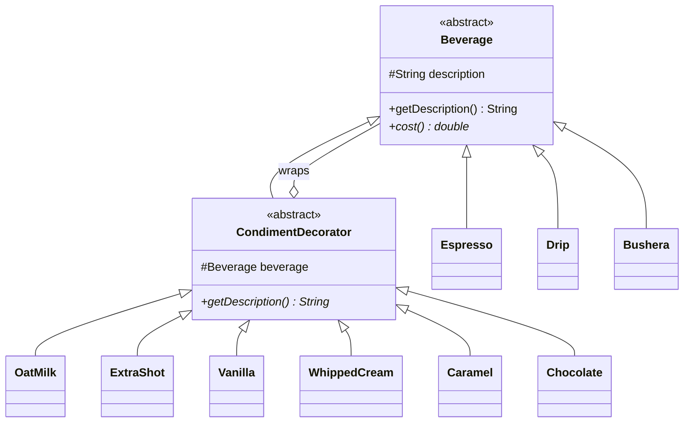
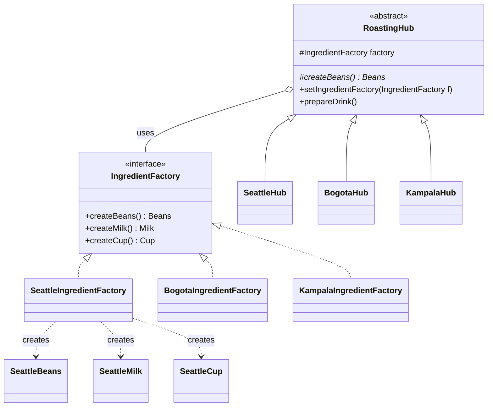
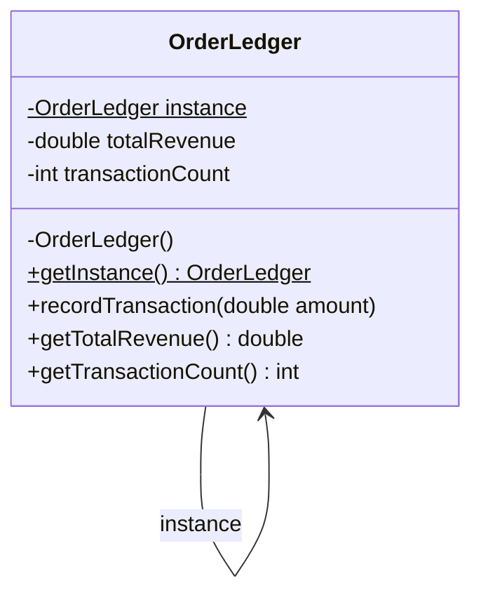
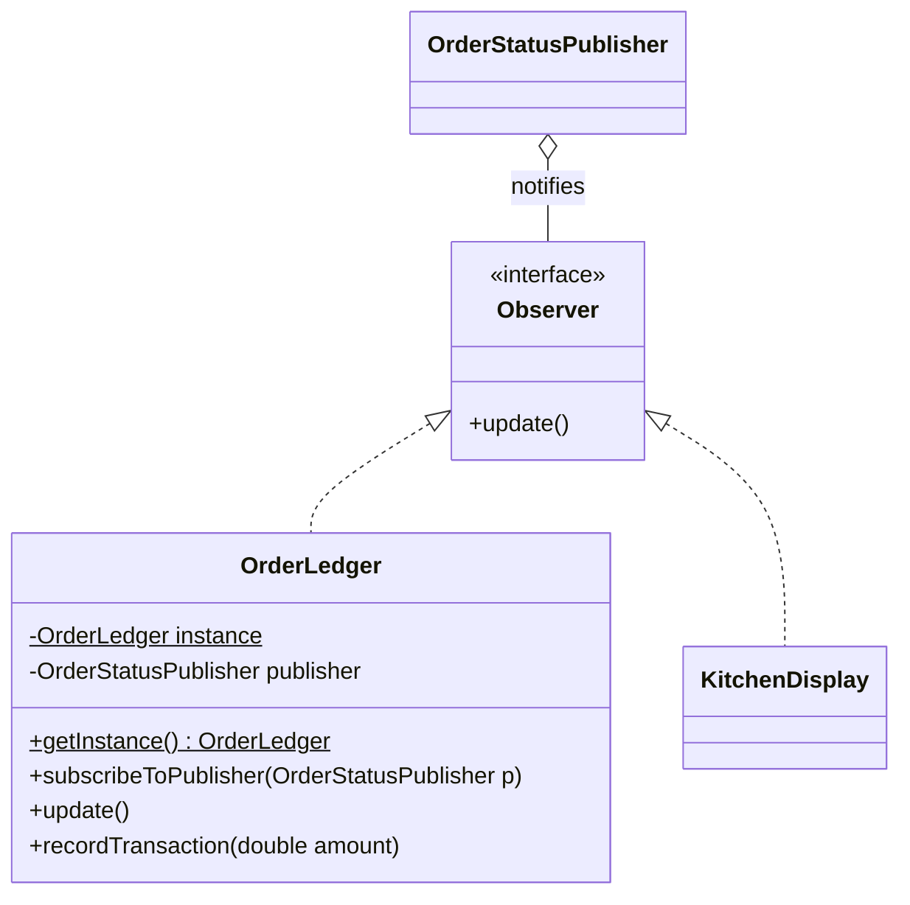

# BrewHub Case Study — Design Patterns Write-Up

| | |
|---|---|
| **Course** | Software Design Patterns  |
| **Textbook** | *Head First Design Patterns*, Chapters 1–5 |
| **Repository** | https://github.com/thefr3spirit/brew-hub |

### Group members

| # | Name | Registration Number |
|---|---|---|
| 1 | OGWAL BILL EDWIN | 2023/BSE/126/PS |
| 2 | *(name)* | *(reg. no.)* |
| 3 | *(name)* | *(reg. no.)* |
| 4 | *(name)* | *(reg. no.)* |
| 5 | *(name)* | *(reg. no.)* |

---

## Overview

| Milestone | Pattern | Problem it solves | Key file(s) |
|---|---|---|---|
| 1 | **Strategy** | Many discount schemes at checkout, with more coming; an if/else chain in `Order` was hard to maintain | `milestone1_strategy/Order.java`, `PricingStrategy.java` |
| 2 | **Observer** | Kitchen display, customer app and inventory tracker must react when an order's status changes, without the order code knowing about them | `milestone2_observer/OrderStatusPublisher.java` |
| 3 | **Decorator** | Any drink can have any combination of condiments; one subclass per combination is impossible | `milestone3_decorator/CondimentDecorator.java` |
| 4 | **Factory Method + Abstract Factory** | Each regional hub must use only its own region's beans, milk and cups — never a mix | `milestone4_factory/RoastingHub.java`, `IngredientFactory.java` |
| 5 | **Singleton** | Exactly one thread-safe ledger must record every payment across all hubs | `milestone5_singleton/OrderLedger.java` |
| Stretch | **Singleton + Observer** | The ledger records a payment only once an order is "ready" | `stretch_goal/Demo.java` |

Each milestone is its own Java package with its own `Demo` and `README.md`. To compile and run everything, from the `BrewHub` folder:

```
javac milestone1_strategy\*.java milestone2_observer\*.java milestone3_decorator\*.java milestone4_factory\*.java milestone5_singleton\*.java stretch_goal\*.java
java milestone1_strategy.BrewHubDemo
java milestone2_observer.Demo
java milestone3_decorator.Demo
java milestone4_factory.Demo
java milestone5_singleton.Demo
java stretch_goal.Demo
```

---

## Milestone 1 — Strategy: Pricing & Loyalty

### Problem
BrewHub has several discount schemes — student, happy hour, loyalty tier and no discount — and new ones keep arriving. The first draft put them all in one if/else chain inside `Order`, so every new discount meant editing `Order` again.

### The pattern in one sentence
**Strategy** puts each algorithm (here, each pricing rule) in its own class behind a common interface, so the object that uses it can swap between them — even while the program is running.

### Class diagram



This mirrors SimUDuck from Chapter 1: `Order` is the `Duck`, `PricingStrategy` is `FlyBehavior`, and `setPricingStrategy()` is `setFlyBehavior()`.

### Key code
`Order` holds a strategy and delegates to it — there is no if/else. *(see `milestone1_strategy/Order.java`)*

```java
public class Order {
    private double subtotal;
    private PricingStrategy pricingStrategy;

    public void setPricingStrategy(PricingStrategy pricingStrategy) {
        this.pricingStrategy = pricingStrategy;      // swap at runtime
    }

    public double getTotal() {
        return pricingStrategy.calculateTotal(subtotal);   // delegate
    }
}
```

A strategy can carry its own settings through its constructor, so one class covers every loyalty tier. *(see `milestone1_strategy/LoyaltyTierPricing.java`)*

```java
public class LoyaltyTierPricing implements PricingStrategy {
    private final double discountRate;

    public LoyaltyTierPricing(double discountRate) {
        this.discountRate = discountRate;
    }

    @Override
    public double calculateTotal(double subtotal) {
        return subtotal * (1 - discountRate);
    }
}
```

Other strategies: `NoDiscount.java`, `StudentDiscount.java` (10%), `HappyHourPricing.java` (20%).

### Demo output
One order is created once, then its strategy is swapped four times (the last swap is a Silver → Gold loyalty upgrade mid-session). *(see `milestone1_strategy/BrewHubDemo.java`)*

```
No discount: 5000.0
Student: 4500.0
Happy hour: 4000.0
Loyalty Silver: 4500.0
Loyalty Gold: 4000.0
```

### Justification — why not just use if/else?
With if/else, every new discount means opening `Order` and adding another branch, so the class keeps growing and every edit risks breaking discounts that already worked. It also mixes all the pricing rules together in one place, which makes them harder to read and test. With the Strategy pattern, each rule lives in its own small class, and `Order` never changes when a new discount is added — we just write a new class. The strategy can also be swapped while the program is running, which an if/else hard-coded into `Order` doesn't handle cleanly.

### Book principles applied
- **Encapsulate what varies** — the pricing rules change often, so they are pulled out of `Order`.
- **Program to an interface, not an implementation** — `Order` only knows `PricingStrategy`.
- **Favor composition over inheritance** — an order *has a* pricing strategy; there is no `StudentOrder` or `HappyHourOrder` subclass.

---

## Milestone 2 — Observer: Live Order & Inventory Dashboards

### Problem
Every order moves through states — queued, brewing, ready — and three systems must react immediately: the kitchen display, the customer's app and the inventory tracker. The order code shouldn't need to know about any of them, and new subscribers should be easy to add.

### The pattern in one sentence
**Observer** lets one object (the subject) keep a list of dependents (observers) and notify all of them automatically when its state changes, without knowing what they are.

### Class diagram



This mirrors the Weather Station from Chapter 2: `OrderStatusPublisher` is `WeatherData`, and the three observers are the displays.

### Key code
The publisher saves the new status and tells every observer something changed. *(see `milestone2_observer/OrderStatusPublisher.java`)*

```java
public void setOrderStatus(String orderId, String orderStatus) {
    this.orderId = orderId;
    this.orderStatus = orderStatus;
    notifyObservers();
}

@Override
public void notifyObservers() {
    for (Observer observer : observers) {
        observer.update();
    }
}
```

Each observer registers itself and **pulls** the data it needs. *(see `milestone2_observer/KitchenDisplay.java`; `CustomerNotifier.java` and `InventoryTracker.java` follow the same shape)*

```java
public KitchenDisplay(OrderStatusPublisher publisher) {
    this.publisher = publisher;
    publisher.registerObserver(this);
}

@Override
public void update() {
    System.out.println("Kitchen Display: Order " + publisher.getOrderId()
            + " is now " + publisher.getOrderStatus());
}
```

### Demo output
Observers subscribe and unsubscribe while the program is running. *(see `milestone2_observer/Demo.java`)*

```
=== Kitchen Display subscribes ===
=== Customer Notifier subscribes ===
Kitchen Display: Order A1 is now queued
Customer Notifier: Your order A1 is now queued

=== Inventory Tracker subscribes ===
Kitchen Display: Order A1 is now brewing
Customer Notifier: Your order A1 is now brewing
Inventory Tracker: Order A1 is now brewing

=== Kitchen Display unsubscribes ===
=== Inventory Tracker unsubscribes ===
Customer Notifier: Your order A1 is now ready
```

### Justification — push or pull?
We chose **pull**. `update()` sends no data; it only tells observers that something changed, and each observer asks the publisher for what it needs using `getOrderId()` and `getOrderStatus()`.

Push would have been simpler here, since the data is small. We chose pull because it copes better with change: if BrewHub adds more order data later, we only add a getter to the publisher — the `Observer` interface and the existing observers don't change, and each observer takes only the data it uses. This paid off in the stretch goal, where we added an order amount without touching any existing observer (see [Stretch Goal](#stretch-goal--singleton--observer-together)).

### Book principle applied
- **Strive for loosely coupled designs between objects that interact** — the publisher only knows its observers are `Observer`s. New observers can be added without changing the publisher.

---

## Milestone 3 — Decorator: Build-Your-Own Drink Pricing

### Problem
Customers can add any condiments — extra shot, oat milk, vanilla, whipped cream — to any base drink, and the combinations are unlimited. A subclass for every combination would mean hundreds of classes.

### The pattern in one sentence
**Decorator** wraps an object in other objects of the same type, each adding its own behaviour (here, cost and description) before or after passing the call to the object inside.

### Class diagram



This is the Starbuzz Coffee design from Chapter 3. Our additions: **Bushera** (new beverage), **Caramel** and **Chocolate** (new condiments).

### Key code
The decorator both *is* a `Beverage` and *has* a `Beverage`. *(see `milestone3_decorator/CondimentDecorator.java`)*

```java
public abstract class CondimentDecorator extends Beverage {
    Beverage beverage;
    public abstract String getDescription();
}
```

Each condiment asks the drink inside it, then adds its own part. *(see `milestone3_decorator/Caramel.java`; all six condiments follow this shape)*

```java
public class Caramel extends CondimentDecorator {
    public Caramel(Beverage beverage) {
        this.beverage = beverage;
    }

    @Override
    public String getDescription() {
        return beverage.getDescription() + ", Caramel";
    }

    @Override
    public double cost() {
        return beverage.cost() + 2000;
    }
}
```

Stacking condiments by wrapping. *(see `milestone3_decorator/Demo.java`)*

```java
Beverage beverage2 = new Bushera();
beverage2 = new ExtraShot(beverage2);
beverage2 = new Caramel(beverage2);
beverage2 = new Caramel(beverage2);   // double caramel
```

### Demo output
```
Espresso, Oat Milk, Vanilla, Whipped Cream, Chocolate, Caramel
Cost: 13000.0
Bushera brewed with coffee, Extra Shot, Caramel, Caramel
Cost: 15000.0
```
Check: 6000 + 2000 + 1000 + 1500 + 500 + 2000 = 13000, and 8000 + 3000 + 2000 + 2000 = 15000. The description lists every layer in the order it was added.

### Justification — one thing this makes easy
Adding the same condiment more than once. The demo makes a Bushera with double caramel just by wrapping it in `Caramel` twice; with subclasses, "double caramel" would need yet another class for every drink. Adding a new condiment is also easy: one new decorator class works with every drink, and no existing class changes.

### Book principle applied
- **Classes should be open for extension, but closed for modification** (Open-Closed Principle) — we added Bushera, Caramel and Chocolate without editing any existing class.

---

## Milestone 4 — Factory Method & Abstract Factory: Multi-Region Sourcing

### Problem
BrewHub has roasting hubs in Seattle and Bogotá (we added Kampala as the third region). Each hub must use only its own region's beans, milk and cups; mixing them breaks a regional sourcing contract.

### The pattern in one sentence
**Abstract Factory** provides one object that creates a whole family of related parts, so they always match; **Factory Method** leaves one creation step as an abstract method that each subclass fills in.

### Class diagram



*(Bogotá and Kampala factories create their own Beans/Milk/Cup the same way; the ingredient interfaces are `Beans`, `Milk` and `Cup`.)*

This mirrors the PizzaStore from Chapter 4: `RoastingHub` is `PizzaStore`, `SeattleHub` is `NYPizzaStore`, and `SeattleIngredientFactory` is `NYPizzaIngredientFactory`.

### Key code
**Abstract Factory** — one factory makes the whole Seattle family. *(see `milestone4_factory/SeattleIngredientFactory.java`)*

```java
public class SeattleIngredientFactory implements IngredientFactory {
    public Beans createBeans() { return new SeattleBeans(); }
    public Milk createMilk()   { return new SeattleMilk(); }
    public Cup createCup()     { return new SeattleCup(); }
}
```

**Factory Method** — the parent class does the work but leaves `createBeans()` to subclasses. *(see `milestone4_factory/RoastingHub.java`)*

```java
public abstract class RoastingHub {
    protected IngredientFactory factory;

    protected abstract Beans createBeans();          // factory method

    public void prepareDrink() {
        Beans beans = createBeans();
        Milk milk = factory.createMilk();
        Cup cup = factory.createCup();
        System.out.println("Preparing drink with " + beans.getName() + ", "
                + milk.getName() + ", and " + cup.getName());
    }
}
```

Each hub picks its factory and implements the factory method. *(see `milestone4_factory/SeattleHub.java`)*

```java
public class SeattleHub extends RoastingHub {
    public SeattleHub() {
        factory = new SeattleIngredientFactory();
    }

    @Override
    protected Beans createBeans() {
        return factory.createBeans();     // from the factory, not "new SeattleBeans()"
    }
}
```

### Demo output
*(see `milestone4_factory/Demo.java`)*
```
--- Seattle hub ---
Preparing drink with Seattle Beans, Seattle Milk, and Seattle Cup
--- Kampala hub ---
Preparing drink with Kampala Beans, Kampala Milk, and Kampala Cup
--- Bogota hub ---
Preparing drink with Bogota Beans, Bogota Milk, and Bogota Cup
--- Seattle hub swapped to Bogota factory ---
Preparing drink with Bogota Beans, Bogota Milk, and Bogota Cup
```

### Justification — why parts can never be mixed
A hub gets all three parts from the **same** factory object, and each factory can only make one region's parts. `createBeans()` also asks the factory instead of calling `new SeattleBeans()` directly. So when the demo swaps the Seattle hub's factory to Bogotá, the whole family changes together — all Bogotá parts, never a mix.

Adding Kampala only needed new classes (`KampalaBeans`, `KampalaMilk`, `KampalaCup`, `KampalaIngredientFactory`, `KampalaHub`); no existing class changed.

### Book principle applied
- **Dependency Inversion Principle — "Depend upon abstractions. Do not depend upon concrete classes."** `RoastingHub` only knows `Beans`, `Milk`, `Cup` and `IngredientFactory`, never `SeattleBeans` or `BogotaIngredientFactory`.

---

## Milestone 5 — Singleton: One Central Order Ledger

### Problem
BrewHub needs exactly one `OrderLedger` recording every paid transaction across all hubs. Two ledgers would split or double-count revenue. Each hub's checkout runs on its own thread, so the ledger must be thread-safe.

### The pattern in one sentence
**Singleton** makes sure a class has only one instance and gives everyone a single global point of access to it.

### Class diagram



This mirrors the ChocolateBoiler from Chapter 5.

### Key code
*(see `milestone5_singleton/OrderLedger.java`)*

```java
public class OrderLedger {
    // eager: created once when the class loads, before any thread can ask for it
    private static final OrderLedger instance = new OrderLedger();

    private double totalRevenue;
    private int transactionCount;

    private OrderLedger() {}                 // nobody else can call new

    public static OrderLedger getInstance() {
        return instance;
    }

    public synchronized void recordTransaction(double amount) {
        totalRevenue += amount;
        transactionCount++;
    }
}
```

The demo runs three hub threads at the same time, each recording 1000 payments of 10. *(see `milestone5_singleton/Demo.java`)*

```java
Thread seattle = new Thread(() -> {
    for (int i = 0; i < 1000; i++) {
        OrderLedger.getInstance().recordTransaction(10);
    }
});
```

### Demo output
```
--- One ledger ---
Same ledger? true
--- Three hubs record 1000 payments of 10 each, at the same time ---
Transactions: 3000 (expected 3000)
Total revenue: 30000.0 (expected 30000.0)
```

### Justification — which fix, and why
We chose **eager creation** out of the book's three fixes (synchronized, eager, double-checked locking).

`getInstance()` is called on every checkout, on every hub's thread, so it is called very often. With the `synchronized` fix, every one of those calls would wait for a lock, even though the ledger only needs to be created once. Double-checked locking avoids that, but it is harder to write and easy to get wrong. Eager creation is the simplest safe option: the JVM creates the ledger once when the class loads, so `getInstance()` just returns it with no locking. Its usual downside — creating the object even if it's never used — doesn't matter, because BrewHub always needs the ledger.

Eager creation only makes *creating* the ledger thread-safe. Updating it is a separate problem, which is why `recordTransaction()` and the getters are still `synchronized` — otherwise two hubs paying at the same moment could overwrite each other and lose a payment.

### Bonus — what would go wrong without a Singleton
If each hub could call `new OrderLedger()`, Seattle's payments would go into one ledger and Bogotá's into another, so no single ledger would show the real revenue. If the same payment were recorded in two ledgers and they were added up at reconciliation, that revenue would be counted twice — the same kind of bug as two ChocolateBoiler objects both thinking the boiler is empty and filling it twice.

### Book principle applied
Chapter 5 does not add a new OO principle. Singleton applies **encapsulation** to object *creation*: the private constructor puts the class itself in control of how many instances exist.

---

## Stretch Goal — Singleton + Observer Together

### How they work together
`OrderLedger` (the Singleton from Milestone 5) now also `implements Observer` (from Milestone 2). It subscribes to `OrderStatusPublisher` like any other observer, but only records a payment when the order reaches **"ready"**. The stretch demo imports and reuses the Milestone 2 and 5 classes — no code is copied.



### Key code
*(see `milestone5_singleton/OrderLedger.java`)*

```java
public void subscribeToPublisher(OrderStatusPublisher publisher) {
    this.publisher = publisher;
    publisher.registerObserver(this);
}

@Override
public void update() {
    if ("ready".equals(publisher.getOrderStatus())) {
        recordTransaction(publisher.getOrderAmount());
    }
}
```

The publisher gained an order amount. *(see `milestone2_observer/OrderStatusPublisher.java`)*

```java
public void setOrderStatus(String orderId, String orderStatus, double orderAmount) {
    this.orderAmount = orderAmount;
    setOrderStatus(orderId, orderStatus);   // reuse the original method
}
```

### Demo output
*(see `stretch_goal/Demo.java`)*
```
--- Order A1 (5000) ---
Kitchen Display: Order A1 is now queued
  Ledger: 0 transactions, total 0.0
Kitchen Display: Order A1 is now brewing
  Ledger: 0 transactions, total 0.0
Kitchen Display: Order A1 is now ready
  Ledger: 1 transactions, total 5000.0
--- Order A2 (3000) ---
Kitchen Display: Order A2 is now queued
  Ledger: 1 transactions, total 5000.0
Kitchen Display: Order A2 is now ready
  Ledger: 2 transactions, total 8000.0
```

### Justification
- **Why `subscribeToPublisher()` instead of the constructor:** the other observers register in their constructors, but a Singleton's constructor is private, takes no arguments and runs when the class loads — before any publisher exists. So the ledger needs a separate method.
- **Why pull paid off:** adding `orderAmount` to the publisher needed no change to the `Observer` interface or to the three existing observers. The Milestone 2 demo still runs unchanged.

---

## Principles Summary

| Head First principle | Chapter | Where it appears in our code |
|---|---|---|
| Identify the aspects that vary and separate them from what stays the same | 1 | M1: pricing rules pulled out of `Order`. M3: condiments separate from base drinks. M4: regional parts separate from hub logic. |
| Program to an interface, not an implementation | 1 | M1: `Order` uses `PricingStrategy`. M2: publisher uses `Observer`. M4: `RoastingHub` uses `IngredientFactory`, `Beans`, `Milk`, `Cup`. |
| Favor composition over inheritance | 1 | M1: `Order` *has a* strategy. M3: decorators *wrap* a beverage. M4: a hub *has a* factory. |
| Strive for loosely coupled designs between objects that interact | 2 | M2: publisher knows nothing about its observers. Stretch: the ledger joins as an observer without the publisher changing. |
| Classes should be open for extension, but closed for modification | 3 | M3: new drinks/condiments without editing old classes. Also M1 (new discount), M2 (new observer), M4 (new region). |
| Depend upon abstractions. Do not depend upon concrete classes | 4 | M4: `RoastingHub` never names a concrete region class. |
| *(Singleton — no new principle; controls instance creation)* | 5 | M5: private constructor + `getInstance()` guarantee one `OrderLedger`. |
